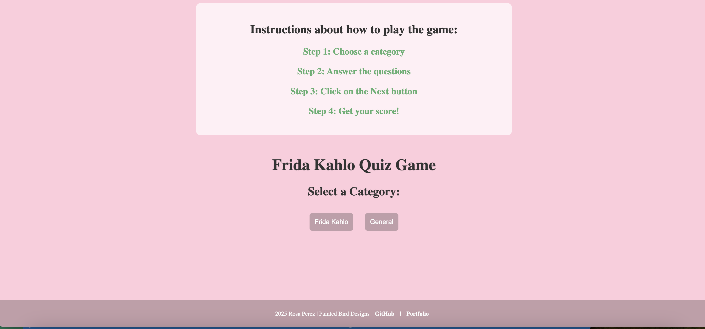
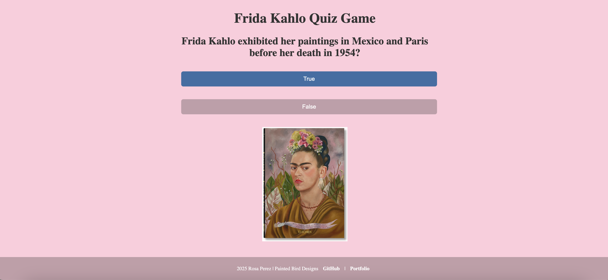
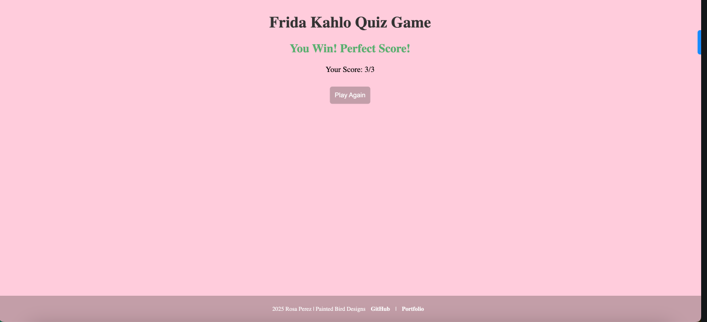

# Frida Kahlo Quiz

Frida Kahlo Quiz is an app that gives users the ability to show off their knowledge of Frida and see their scores.

Check out the Application [Here](https://paintedlbird7.github.io/Quiz_Proj_1/) 

| Resource            | Link |
|---------------------|------|
| **Product Canvas**  | [View Product Canvas](https://docs.google.com/document/d/1MhmoJ3OM9fy1GUrUz33NOj95X-tXdq-q2yEAqStG6B8/edit?usp=sharing) |
| **Asana Board**     | [View Asana Board](https://app.asana.com/0/1209469544196295/1209469350292583) |
| **GitHub Pages**    | [View Deployed App](https://paintedlbird7.github.io/Quiz_Proj_1/) |
| **GitHub Repo**     | [View Repository](https://github.com/paintedlbird7/Quiz_Proj_1) |

### Key Features

- User can access the quiz game.
- User can play the quiz games.
- User can view the quiz questions.
- User can see their score displayed on the screen.
- User gets a congratulatory or a try again voice message

## Tech Stack
### Front end build using: 
 HTML, CSS, JavaScript

 Front end deployed using [Github Pages](https://pages.github.com/)

### Clone this repository and navigate into

`git clone https://github.com/paintedlbird7/Quiz_Proj_1 && cd Quiz_Proj_1`

## Documentation 

This application is deployed on [Github Pages](https://paintedlbird7.github.io/Quiz_Proj_1/).

 ---
## Frameworks - Libraries

- What 3rd party frameworks/libraries are you considering using?

FE: Jest

## Atributes

- congrats audio: pixabay.com
- try again audio: backtracks4all.com
- audio cut:  mp3cut.net
- image: taschen.com

## Next Up

Build post endpoint to site to allow for people to upload their own questions.

 ## Contributors
   
 ### Rosa Perez [GitHub](https://github.com/paintedlbird7)

 | Resource            | Link |
|---------------------|------|
| **Product Canvas**  | [View Product Canvas](https://docs.google.com/document/d/1MhmoJ3OM9fy1GUrUz33NOj95X-tXdq-q2yEAqStG6B8/edit?usp=sharing) |
| **Asana Board**     | [View Asana Board](https://app.asana.com/0/1209469544196295/1209469350292583) |
| **GitHub Pages**    | [View Deployed App](https://paintedlbird7.github.io/Quiz_Proj_1/) |
| **GitHub Repo**     | [View Repository](https://github.com/paintedlbird7/Quiz_Proj_1) |

Check out the Application [Here](https://paintedlbird7.github.io/Quiz_Proj_1/) 